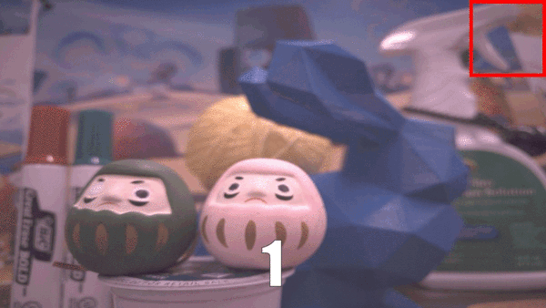
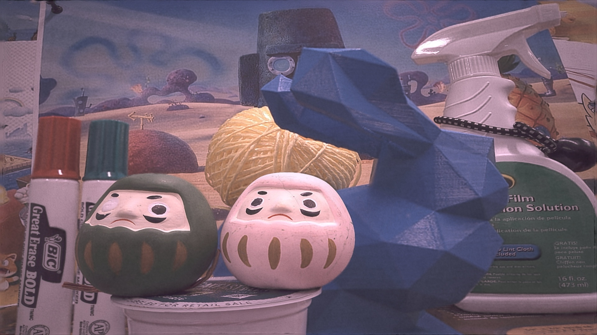
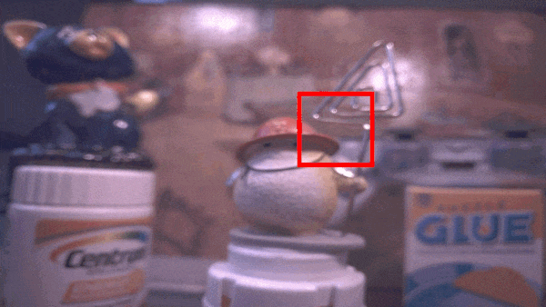
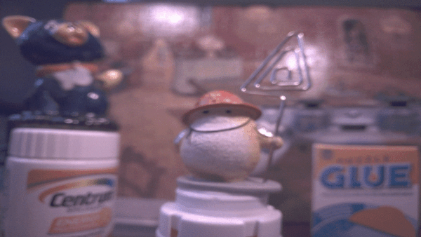
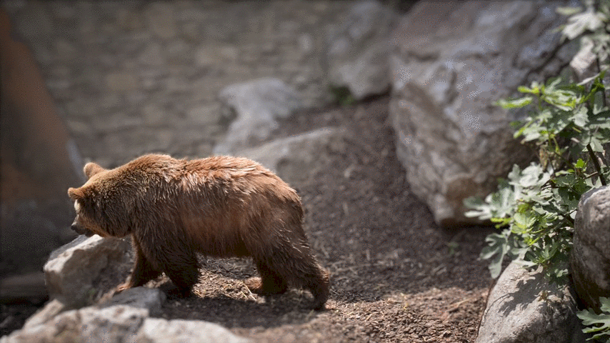
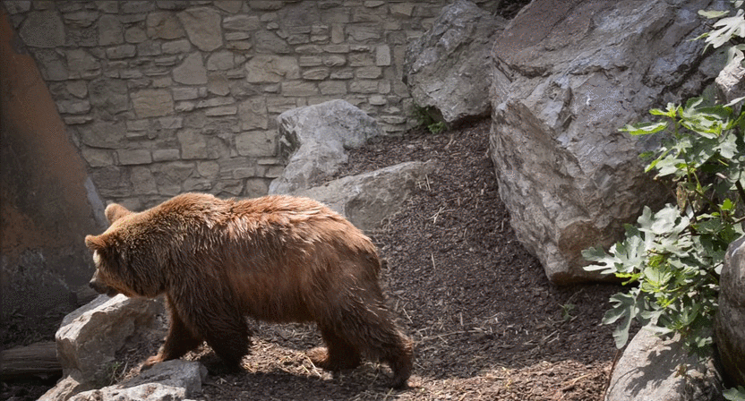

# Result GIFs
#### Qian Huang
#### 09/26/2022

## All-in-Focus (AIF) Pipeline Results
Objects were randomly placed in front of the camera. The red windows indicate the predicated window locations by policy network.

### Static Scene

Sampled frames

AIF frames

### Dynamic Scene

Sampled frames

AIF frames

## Fusion Results
We show some fusion results of the network after transfer learning. Focus positions of It s were randomly selected for DAVIS frames. Suppose we had the ground-truth J1 and the algorithm started from t=2. Videos were generated by iteratively reconstructing Jt from the last prediction Jt-1 and It. 

### Trainingset

Defocused frames

Fused frames

### Testset

Defocused frames

Fused frames

